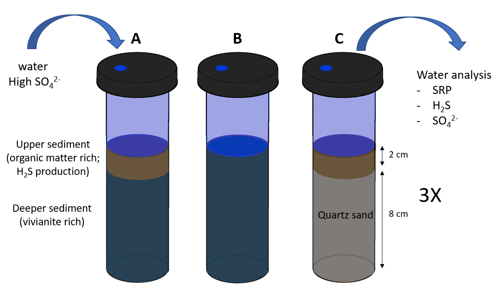

# Vivianite as a phosphorus source in lake sediments: Importance of increased sulfate reduction on phosphorus mobilization[^01-paper2]

[^01-paper2]: A modified version of this chapter was published as: van Kuppevelt H, Reitzel K, Hupfer M (2025) Vivianite as a phosphorus source in lake sediments: Importance of increased sulphate reduction on phosphorus mobilisation. J Soils Sediments. https://doi.org/10.1007/s11368-025-03986-z

```{r IncubationSetup,echo=FALSE, fig.cap="Graphic depicting the experimental mesocosm setup: organic matter-rich sediment (OM) was overlain on top of vivianite-rich sediment (Viv.). As control the two types of sediment were also incubated individually, with quartz sand (Qs) below the organic sediment to substitute the volume. At regular intervals, water samples were taken an analysed, and sulphate was replenished.", out.width="0.7\\linewidth", fig.align="center"}

```

## Abstract {-}

\noindent __Purpose__: Eutrophication of freshwater systems is primarily driven by excessive nutrient inputs, particularly phosphorus (P). While external nutrient control has been emphasized, the prediction and management of internal P loading from sedimentary sources remain complex. This study examines the role of vivianite (Fe(II)_3_(PO_4_)_2_·8H_2_O), a P-bearing mineral in anoxic sediments, in contributing to internal P release under sulfidic conditions.

\noindent __Materials and Methods__: A mesocosm experiment was conducted using sediment cores from Lake Arendsee, Germany. The cores were exposed to elevated sulfate concentrations to induce sulfate reduction, simulating anoxic and sulfidic conditions. Both water column chemistry and sediment solid-phase analyses were performed. P release from vivianite-rich sediments was monitored, along with changes in iron (Fe) mineral phases using sequential extraction and X-ray diffraction.

\noindent __Results and Discussion__: Increased sulfate reduction rates significantly mobilized P from vivianite-rich sediments, leading to elevated soluble reactive P levels in the water column. A marked decrease in vivianite content and an increase in sulfide-bound Fe species were observed in the sediments. These findings demonstrate that vivianite in Fe-rich sediments serves as an important internal P source under sulfidic conditions, exacerbating P release.

\noindent __Conclusions__: This study highlights the role of sulfur cycling in internal P loading and suggests that increased sulfate inputs may enhance eutrophication by mobilizing P from buried vivianite. Effective management of eutrophication should consider both external inputs and internal P sources like vivianite.

## Introduction

Eutrophication is a significant environmental issue that affects freshwater systems globally and is driven by an excess of nutrients in water bodies, resulting in excessive algal blooms, oxygen depletion, and diminished water quality [@Correll1998; @Ansari2014]. Managing nutrient levels in water is crucial for the restoration of lake ecosystems and the prevention of further degradation. Phosphorus (P) often serves as a limiting factor for primary production and is a focal point for management interventions [@Azam2014; @Tammeorg2024]. Despite concentrated efforts on controlling external sources of nutrients such as agricultural runoff and wastewater discharge, water quality targets remain unmet.

For instance, the EU’s Water Framework Directive mandates member states to restore lakes within a relatively short time frame [WaterFrameworkDirective2000]. Consequently, contemporary lake management strategies aim to integrate both external and internal measures, with the latter focusing on mitigating the release of P from sediments into the water body [@Tammeorg2024]. Managing internal P release can accelerate the effectiveness of reducing external P sources and compensate for high external loads when external measures prove inadequate. A key strategy for internal control involves preventing the release of P from sequestered pools in sediments (burial P). Even after addressing external sources, the internal supply of P can perpetuate eutrophic conditions, especially when the water residence time is high [@Sondergaard2001; @Wagner2020]. However, the processes and sources that drive P release from burial P are not yet fully understood.

The retention of P in sediments occurs through its binding to the solid phase via biological and chemical precipitation [@Boers1998; @Parsons2017; @OConnell2020]. Burial P pools accumulate in sediment following years of nutrient enrichment. The speciation of sediment P is highly dependent on lake conditions and undergoes significant changes during early diagenesis, where remobilization of labile forms of P occurs, whereas only the stable forms of solid-bound P are buried long-term [@Emerson1976; @Boers1998]. Initially, the sedimentation of P incorporated into organic matter by primary producers is an important influx of P to lake sediments, especially in eutrophic lakes. However, the long-term burial of organic matter-bound P is constrained by remineralization processes in the sediment [@Boers1998]. Secondly, P can adsorb to iron (Fe) hydroxides [@Gunnars2002] and bind to organic matter to form organic Fe-P complexes [@Schwertmann1988]. The precipitation of these ferric Fe-bound P forms (Fe(III)-bound P) can be a major internal sink of P in lakes with naturally high Fe content [@Reitzel2005; @Hupfer2008] or those artificially treated with Fe [@Kleeberg2012; @Munch2024]. Under the reducing conditions induced by organic matter decomposition in the sediment, Fe(III) is reduced to Fe(II), leading to the release of bound P and preventing the long-term burial of Fe(III)-bound P. However, P can be sequestered long-term in the form of the Fe(II) mineral vivianite (Fe(II)₃(PO₄)₂·8H₂O) [@Rothe2016], which has been identified as a major form of burial P in eutrophic, high-Fe, and non-sulfidic freshwater systems [@OConnell2015; @Rothe2016; @Dijkstra2018; @Kubeneck2021].

The role of sulfur (S) cycling in influencing Fe dynamics and internal P cycling has been recognized as crucial [@Kleeberg1997; @Rozan2002; @Wang2018; @Heinrich2021], including its impact on vivianite formation [@Rothe2015]. Sulfate (SO₄²⁻) is the dominant form of S in the water column but can be reduced to sulfide (S²⁻) by sulfate-reducing bacteria (SRB) in the sediment during decomposition processes. Sulfide readily binds to Fe, leading to the formation of Fe sulfides such as pyrite (FeS₂) and Fe monosulfide (FeS). This process effectively immobilizes Fe, removing it from the pool available to form Fe(III)–P or vivianite, thereby affecting the efficiency of P immobilization by Fe in sediments [@Heinrich2020].

An increase in the sulfate reduction rate (SRR) can potentially remobilize the burial pools of Fe–P [@Roden1997; @Katsev2006]. The SRR is influenced by the concentration of sulfate in the sulfate reduction zone, as well as other factors such as temperature [@Zhao2021; @Han2023] and organic matter availability [@Chen2014; @Zhao2019]. Several studies have reported a substantial increase in sediment P release following an increase in water sulfate concentrations in both laboratory experiments [@Zak2006; @Baldwin2012; @Chen2016; @Zhou2022] and in situ studies [@Smolders1993; @Lamers2002]. Over the past century, global freshwater sulfate concentrations have significantly increased because of human activities, remaining well above pre-industrial levels [@Kleeberg2014; @Zak2021].

The formation of vivianite in lake sediments is a focal point of ongoing research. Evidence of vivianite in older sediment strata underscores the significance of early diagenesis in its formation [@Dijkstra2018; @Scholtysik2022]. This phenomenon has also been observed following Fe based treatments implemented for lake restoration [@Heinrich2021]. Prior research has identified the availability of Fe(III)–bound P [@Heinrich2020; @Kubeneck2024], redox fluctuations [@Parsons2017], and microbial activity [@Cosmidis2014; @Sanchez2015] as critical environmental factors influencing vivianite formation.

Although vivianite is redox stable and acts as a substantial P sink in anoxic sediments, its long-term stability is not well understood. Vivianite can incorporate significant amounts of P into its structure, contributing notably to the total phosphorus (TP) content in sediments; Rothe (2016) estimated that vivianite-bound P constituted approximately 50% of TP at certain depths in Lake Arendsee [@Rothe2016]. Therefore, if vivianite-bound P pools exist within the sediment, their mobilization could sustain a prolonged release of internal P, exceeding duration estimated from traditional P sources such as Fe(III)–P [@Katsev2006].

Scholars have hypothesized that an increase in sulphide production may lead to sustained P mobilization from buried vivianite by preferentially binding Fe [@Roden1997; @Gachter2003; @Katsev2006]. However, this process has not been directly demonstrated in situ, leaving its extent and significance for long-term P release uncertain. In a laboratory setting, Wilfert et al. (2020) demonstrated that pure vivianite released up to 92% of its P when exposed to sulfide [@Wilfert2020]. More recently, Kubeneck et al. (2024) demonstrated that this process could also occur under natural pore water conditions by placing synthetic vivianite in mesh bags within the sulfidic sediments of an intertidal flat, resulting in a 30% decrease in vivianite P [@Kubeneck2024].

The present study aimed to further explore the dilapidation of vivianite within freshwater sediments and evaluate its potential contribution to P loading in the water column. This was accomplished by incubating authigenic vivianite in sediments from the sulfidic, dimictic Lake Arendsee in northern Germany, followed by monitoring the dissolution of vivianite and the subsequent release of P over time.
Reference figure 2 here \@ref(fig:IncubationTimeseries)

```{r IncubationTimeseries,echo=FALSE, fig.cap="Time series of cumulative load of Soluble Reactive Phosphorus (SRP), sulphate, and sulphide to the water column from mesocosm during incubation over a period of approximately 250 days. The change of each species over time was fitted with a linear model, where the slope represents the release rate from the sediment to the water column, which values can be found in Table 2. Viv. + OM: cores with 8 cm of deep (30–35 cm sediment depth), vivianite-rich sediment overlain with 2 cm of sediment rich in organic matter. Viv.: 10 cm of vivianite-rich sediment. Qs + OM: 2 cm of organic matter-rich sediment, on top of 8 cm of quartz sand. ", message=FALSE, results="asis" }
source("scripts/Incubation_Timeseries.R")
legend_labels <- c("Viv. + OM", "Viv.", "Qs + OM", "4")
colors <- list(c("#E69F00", "#56B4E9", "#009E73", 
                 "#F0E442"))
 ggplot(ratesmean %>% transform( Parameter = factor(Parameter, levels = c("SRP", "Sulfate","Sulfide"), labels = c("SRP","Sulphate", "Sulphide"))), mapping = aes(x = Time, y = load, color = Treatment, shape = Treatment)) +
  geom_path(na.rm = T) +
  geom_point(na.rm = T) +
  geom_errorbar( aes(ymin = load - sdload, ymax = load + sdload), width = 1, position = position_dodge(0.1)) +
  geom_smooth(method='lm', linetype = "dotted", alpha = 0.1 ) +
  scale_color_manual(values = unlist(colors), labels = legend_labels, name = "treatment") +
  scale_shape_manual(values = c(19,17,15), labels = legend_labels, name = "treatment") +
  guides(color = guide_legend(label.position = "top", label.hjust = 1)) +
  labs(y = expression(paste("cumulative load (",mu,"mol cm"^{-2},") ")),
       x = "Time (days)") +
  theme_bw(base_size = 12) +
  facet_grid(rows = "Parameter", scale = "free_y")+
  theme(
    axis.text = element_text(size = 10, angle = 0, hjust = 0.5),
    strip.background = element_blank(),
    strip.text.y = element_text(angle= 0, size=12, face="bold", hjust = 0.5),
    legend.title = element_blank(),
    legend.text = element_text(size = 12,face = "bold"),
    legend.key.width = unit(1,"mm"),
    legend.margin = margin(0, 0, 0, 0),
    legend.position = "top"
  )
```

## Methods

###	Study Site

Sediment and water samples were collected from Lake Arendsee in northern Germany, located at 52°52'36.12"N, 11°29'12.12"E. Lake Arendsee is a dimictic lake, formed by salt karst processes, and has a relatively long water residence time of 50–60 years. The lake is primarily fed by groundwater and lacks natural drainage [@Meinikmann2015]. It reaches a maximum depth of 49.5 meters, an average depth of 29 meters, and covers a surface area of 5.14 km2. Since the 1960s, the lake has undergone significant eutrophication due to urban discharge from the city of Arendsee on the southern shore and drainage from nearby Lake Fauler [@Scharf1998]. P levels in the water column remain elevated due to ongoing groundwater P loading and the accumulation of P from historical inputs, exacerbated by the long water residence time [@Hupfer2019]. 
In addition to high P concentrations (2023 yearly mean of 178 µg L-1; https://www.igb-berlin.de/der-arendsee), Lake Arendsee also contains considerable sulfate concentrations (61±7 mg L-1 in January 2023), originating from groundwater influenced by natural geological conditions, including gypsum in the catchment. The organic-rich top sediment layers exhibit significant sulfide production, leading to the formation of Fe sulfide with low total Fe content. In contrast, deeper in the sediment (below approximately 25 cm), the Fe content is much higher, and vivianite is a predominant Fe species [@Rothe2015; @Scholtysik2022].

###	Sample collection

Surface water was collected into a 20 L plastic barrel, from which 10 L were filtered through pressure filtration (0.45 μm, cellulose acetate) to remove particulate matter, and then stored in 5 L canisters. Mixed sediment samples were obtained near the lake's deepest points and classified as organic matter-rich upper sediment (0–2 cm) and vivianite-rich deep sediment (30–35 cm). Sediment coring was performed using a UWITEC piston gravity corer with Plexiglas tubes measuring 60 cm in length and 6 cm in diameter. The cores were sectioned on-site, and the selected slices were carefully combined and stored in air-tight Ziplock bags, followed by vacuum sealing to minimize oxygen exposure. The samples were transported immediately to the laboratory and stored at 4 °C for less than a week before the commencement of the experiment. Approximately 2 L of vivianite-rich and 0.5 L of organic matter-rich sediments were collected.

###	Sulphate reduction experiment

The impact of sulfate reduction on vivianite in natural sediments was investigated by incubating the sediment in controlled mesocosms with added sulfate under anoxic conditions (Fig. \@ref(fig:IncubationSetup)). The incubations were conducted in a climate chamber maintained at 12 °C. Unless otherwise noted, all water used in the experiments was sourced from Lake Arendsee and deoxygenated by bubbling with an N~2~/CO~2~ mixture for a minimum of 6 h. Within a nitrogen-filled glove bag (Glas-Col 108D X-27-27H, O2 <1%), sealed bags of sediment from Lake Arendsee were opened, transferred to a bucket, and vigorously stirred. 
For the mesocosm setup, nine Plexiglas tubes—each 30 cm tall and 6 cm in diameter with sliding pistons at the bottom—were prepared in a glove bag for three sets of triplicate treatments. In the first treatment (Fig. \@ref(fig:IncubationSetup), A), tubes were filled with a combination of vivianite-rich and organic matter-rich sediments (Viv. + OM). In the second treatment (Fig. \@ref(fig:IncubationSetup), B), only vivianite-rich sediment was used (Viv.). In the third treatment (Fig. \@ref(fig:IncubationSetup), C), tubes contained only organic matter-rich sediment atop quartz sand, serving as an inert filler to equalise sediment and water column heights across treatments (Qs + OM; Fig. \@ref(fig:IncubationSetup)).
Prior to the experiment, tubes designated for treatments Viv. and Viv. + OM were carefully filled with deep vivianite-rich sediment to a depth of 10 cm, ensuring no gas was trapped beneath the sediment. For the Qs + OM treatment, tubes were filled with equivalent volumes of quartz sand. Subsequently, the deoxygenated lake water was poured over the sediment to fill the tubes halfway. The tubes were stagnated overnight to allow the sediment to settle and create a uniform surface for the subsequent layer. The following day, the final sediment layer was added to the mesocosms for treatments Viv. + OM and Qs + OM. For each mesocosm, 60 mL of the upper sediment layer was transferred and allowed to settle at a well-defined sediment-water interface (SWI), after which the height of the water column above the SWI was measured.
Thereafter, all tubes were sealed with custom-made airtight caps equipped with stirring magnets and completely filled with anoxic surface water. The sulfate concentration in the overlying water was adjusted to 150 mg L^-1^ (1.6 mmol L^-1^) by adding approximately 4 mL of a 10.01 g L^-1^ SO~4~^2-^ stock solution. Water samples were acquired immediately after setting up the mesocosms to confirm initial sulfate concentrations. The airtight caps ensured the maintenance of anoxic conditions throughout the 242-day incubation period. Sampling was conducted in a nitrogen atmosphere by flushing the glove bag before opening the caps. Water samples were taken at predetermined intervals, subsampled, and replenished with deoxygenated surface water. Sulfate levels were periodically adjusted to maintain a concentration of 150 mg L^-1^. After the incubation, the sediment was analyzed to assess the variations in its solid-phase composition.

###	Sample processing
At the end of the incubation period, the tubes were removed from the glove bag for subsequent processing. The caps were detached, and the final water samples were collected and subsampled before discarding the remaining water, leaving approximately 10 cm above the SWI. Despite air exposure after the removal of the caps and glove bag, the risk of oxygen affecting the sediment prior to slicing was minimal owing to the short duration of exposure compared to the time required for diffusive transport through the water column (hours versus days). The sediment was then sliced to determine the depth profiles of chemical composition and P speciation in the solid phase. To minimize oxygen exposure, sediment processing was conducted immediately and completed within 24 h. Additionally, the exposure was limited by storing the sediments in closed airtight containers, as oxidation can significantly alter P speciation in anoxic sediments [@Kraal2014].
The upper 3 cm of the cores were sliced at 0.5 cm intervals, followed by two slices at 1 cm intervals, while deeper layers were sliced at 2 cm intervals down to a depth of 10 cm. The slices were carefully collected and homogenized. Mixed sediment sections were created by pooling equal weights from triplicate slices. This mixed sediment was stored in closed containers at 4 °C overnight, and subsamples were taken the following day for sequential extractions, analysis of dry weight (DW), and loss on ignition (LOI). After subsampling, the mixed sediment was frozen at -20 °C, then freeze dried and ground using an agate mortar and pestle. The dry, powdered sediments were stored in the dark at room temperature and later analysed for elemental and mineralogical composition.


```{r IncubationComposition,echo=FALSE, fig.cap="Elemental composition profiles of the sediment solid phase of selected elements. The composition of the initial sediment is represented as vertical lines, dotted for deep vivianite-rich sediment and dashed for the upper organic-rich sediment. The last panel shows the proportion of the vivianite-rich sediment in the treatment with both sediment types, where 1 indicates 100% vivianite-rich sediment, while 0 represents 100% OM-rich sediment. Inert elements (aluminium (Al) and Titanium (Ti)), as well Fe and Manganese (Mn) concentrations after incubation were compared to the starting sediment concentrations to determine the sediment type. At the start of the experiment, 2 cm of organic-rich sediment was stacked on top of vivianite-rich sediment. After incubation this was still apparent, while the half centimetre slice between 2.0–2.5 cm depth features a mix of approximately 60%/40% vivianite-rich/OM-rich sediment. ", message=FALSE, results="asis", fig.height = 5 }
source("scripts/Incubation_elements.R")


plot_kwa <- function(elem){
  elem2 <- elem %>% str_remove("Total_")
 plot <-  ggplot( kwaplotdata %>% filter(Measurement %in% elem), 
                                   mapping =  aes( x=Depth, y = Cont, color = Treatment, shape = Treatment)) +
    geom_line()+
    geom_point(size= 2) +
    geom_hline( 
      data =  filter(kwabefore,Sample == "Shallow", Parameter %in% elem2), 
      aes( yintercept = Value, linetype = "dashed" ),
      color=c("grey10")
    )+
    geom_hline( 
      data =  filter(kwabefore,Sample == "Deep", Parameter %in% elem2), 
      aes( yintercept = Value,linetype = "dotted"),
      color=c("grey10")
    )+
    scale_color_manual(values = unlist(colors), labels = legend_labels, name = "treatment")+
    scale_shape_manual(values = c(19,17,15), labels = legend_labels, name = "treatment") +
    scale_linetype_manual(name = "Start sed." , values = c("dashed","dotted"), 
                          guide = guide_legend(override.aes = list(color = "grey10")), labels = c("OM","Viv."))+
    coord_flip()+
    scale_x_reverse(limits = c(8,0)) + 
    scale_y_continuous(breaks = equal_breaks(3,0.13,0)) +
    labs(y = expression(paste(" concentration (", mu,"mol gDW"^-1,") " )),
         x = "Depth (cm)"
    ) +
    facet_wrap(.~ Parameter, scales = "free", ncol = 4) +
    theme_classic(base_size = 12)+
    theme(
      axis.title=element_text(size=12),plot.title = element_text(hjust = 0.5),
      axis.text=element_text(size=10,angle = 0, hjust = 0.5),
      panel.background = element_rect(colour = "grey20",linewidth = 1),
      strip.text = element_text(size=12, face="bold", hjust = 0.5) ,
      strip.background = element_blank(),
      legend.position = "bottom",
      legend.title = element_text( size = 12),
      legend.text = element_text(size = 12),
      legend.key.size = unit(1.2, "cm"),
      legend.key = element_rect(colour = "transparent"),
      legend.background = element_rect(colour='grey')) 
  return(plot)
}


kwa_plot1 <- plot_kwa(c("Total_TP","Total_S", "Total_Ca"))

kwa_plot2 <- plot_kwa(c("Total_Mn", "Total_Fe", "Total_Al","Total_Ti"))

label_areas <- tibble(Labels = c("OM","Mix", "Viv."), Y = rep(0.25,3), X = c(1, 2.25,  4) )

mix_plot <- ggplot( filter(load, Sample != "C4", Treatment == "A"), 
                    aes( x=Depth, y = rmean, color = Treatment, shape = Treatment),
                    scale_x_discrete(position = 'top')) +
  annotate(geom = "rect", xmin = 2, xmax = 8,
           ymin = -Inf, ymax = Inf,
           color = "transparent",
           fill = "#294154",
           alpha = .1) +
  annotate(geom = "rect", xmin = 0, xmax = 2.5,
           ymin = -Inf, ymax = Inf,
           color = "transparent",
           fill = "#69543d",
           alpha = .1) +  
  geom_text(data = label_areas, mapping = aes(
    label=Labels, 
    x=X,
    y=Y,
    fontface = "italic"),
    inherit.aes = FALSE
  ) +
  geom_line( )+
  geom_point()+
  geom_errorbar(
    aes(ymin = rmean - rdeep_sd, ymax = rmean + rdeep_sd, color= Treatment),
    position = position_dodge(),
    width = 0.5)+
  geom_hline( 
    aes( yintercept = 0, linetype = "dashed"),
    color=c("grey10")
  )+
  geom_hline( 
    aes( yintercept = 1, linetype = "dotted"),
    color=c("grey10")
  )+
  coord_flip()+
  scale_x_reverse(limits = c(8,0)) + 
  #scale_y_continuous(labels = scientific) +
  scale_color_manual(values = unlist(colors), labels = legend_labels, name = "Parameter") +
  labs(y = expression(paste("frac. Viv. sed." )),
       x = "Depth (cm)"
  ) +
  
  theme_classic(base_size = 12)+
  theme(
    #aspect.ratio = 2,
    axis.title=element_text(size=12),
    axis.title.y = element_blank(),
    axis.text=element_text(size=10,angle = 0, hjust = 0.5),
    legend.position = "none",
    legend.title = element_text( size = 12),
    panel.background = element_rect(colour = "grey20",linewidth = 1),
    legend.text = element_text(size = 12),
    legend.key.size = unit(1.2, "mm"),
    legend.background = element_rect(colour='grey')) 

legend <- cowplot::get_plot_component(kwa_plot1, 'guide-box-bottom', return_all = TRUE)
plots <- align_plots(kwa_plot1+theme(legend.position="none"), kwa_plot2+theme(legend.position="none"), align = 'v', axis = 'l')
# then build the bottom row
panel1 <- plot_grid(plots[[1]],legend,  rel_widths = c(3,2))
panel2 <- plot_grid(plots[[2]],mix_plot, axis = "tb", align = "h", rel_widths = c(4,1))
grid_plot <- plot_grid(panel1, panel2,
                       nrow = 2, align = "h", rel_heights = c(1,1))

show(grid_plot)

```


###	Chemical analysis

####	Solid phase analysis

The DW and LOI of the sediment samples were determined by weighing approximately 1 g of subsamples, followed by drying at 105 °C for 24 h and combustion at 450 °C for 3 h, respectively. Elemental analysis of the dry sediment was conducted using reverse aqua regia digestion (DIN 38 414-S7, 1983). Approximately 70 mg of dried and ground sediment was digested in 2 mL of 37% HCl and 6 mL of 65% HNO3 in a high-pressure microwave oven (#Prep-A, MLS 169 GmbH). Following dilution, element concentrations were measured by inductively coupled plasma optical emission spectrometry (ICP-OES).
To qualitatively assess the mineral composition and identify the presence of vivianite in dry sediment, powder X-ray diffraction (XRD) analyses were conducted. These analyses utilized a Bruker D2 Phaser equipped with a Cobalt X-ray source and an SSD160 detector. Each sample was analysed over a duration of 1 h, covering a range from 10° to 85° 2θ, with a step size of 0.014 2θ. The device settings included a rotating sample holder, a 1-mm fixed divergence slit, 2.5° primary and secondary Soller collimators, a fixed scatter screen at a 3 mm sample distance, and an Fe k-beta filter (2.5). The Bruker DIFFRAC.EVA software was employed for qualitative mineralogical analysis, with mineral identification achieved by comparing results with reference diffractograms from the Crystallography Open Database.

####	Phosphorus Sequential Extraction

The P and Fe species in the sediment were determined using a sequential extraction protocol, which was originally developed by Psenner et al. (1984) and later modified by Wang et al. (2021) for vivianite extraction [@Psenner1984; @Wang2021]. A precisely weighed 0.6 g of wet sediment was placed into 15 mL centrifuge tubes. The extraction process consisted of five steps (Table \@ref(tab:IncubationSeqTable)). Extracts were filtered, acidified, and analysed for P using the molybdenum blue method [@Murphy1962]. For the NaOH fraction, extracts were analysed both before and after digestion with K~2~S~2~O~8~ to differentiate soluble reactive phosphorus (NaOH-SRP) from nonreactive phosphorus (NaOH-NRP). Specific fractions were designated for Fe analysis (BD-Fe and Bipy-Fe) using Atomic Absorption Spectroscopy (AAS; pinAAcle9001; PerkinElmer, Waltham, MA, USA).


```{r IncubationSeqTable, results="asis", echo = FALSE}

library(knitr)

# Create the data frame
df <- data.frame(
  Step = c("1", "2", "3", "4a", "4b", "5", "6"),
  Extractant = c("Deoxygenated MQ H₂O",
                 "0.2% 2,2′-bipyridine + 0.1 M KCl",
                 "0.111 M Na₂S₂O₄/0.11 M NaHCO₃",
                 "0.1 M NaOH",
                 "",
                 "0.5 M HCl",
                 "Aqua regia digestion"),
  P_fraction = c("H₂O-P", "Bipy-P", "BD-P", "NaOH-SRP", "NaOH-NRP", "HCl-P", "TP"),
  Target_P_species = c("Labile P, porewater P",
                       "Vivianite-P, Fe(II)-bound P",
                       "Reducible Fe–P species",
                       "P bound to metals",
                       "Biogenic P, difference between TP and SRP",
                       "Calcium bound P",
                       "Total P"),
  stringsAsFactors = FALSE
)

# Print the table with a caption (using bookdown style for label)
kbl(df, booktabs = T, col.names = c("Step", "Extractant", "P fraction", "Target P species"), caption = ("Sequential extraction steps used in the experiment, based on the protocol of Wang et al. (2021).")) %>%
kable_styling(latex_options = c("scale_down"))

```


####	Dissolved elemental analysis

Surface water samples were subdivided into three parts post-filtration (0.22 µm, 0.45 µm cellulose acetate). A 10 mL subsample was preserved with hydrochloric acid for P concentration analysis using the molybdate blue method [@Murphy1962]. Sulfide concentrations in 2 mL subsamples were fixed with a 2% zinc acetate solution (200 µL) and measured photometrically using the methylene blue method [@Cline1969]. Sulfate concentrations were determined photometrically after filtering through a 0.22 µm cellulose acetate filter, using the BaSO4 colloid method [@Tabatabai1974]. Additionally, the elemental content (Fe, P, S, Mn, Ca, Al, and Ti) of the digested sediment was quantified using inductively coupled plasma optical emission spectroscopy (ICP-OES, iCAP 7000 series, Thermo Scientific).

###	Data processing and statistical analysis

Data analysis was conducted using R, and the detailed calculations are provided in the Supplementary Material. The release of P, sulfate, and sulfide from the sediment was determined by summing the changes in water column content at each time step, including any added sulfate stock. The variations in sediment composition were assessed by estimating the initial composition based on measurements of starting sediment compositions. This study utilized two types of sediments (Viv. + OM), with the estimated starting composition for each sediment slice derived from the concentrations of unchanged elements (Al, Ti, Fe, and Mn). Concentrations per volume and per surface area, integrated over the measured depths, were calculated from per-dry weight values by estimating the sediment bulk density from dry weight and loss on ignition (LOI) values [@Avnimelech2001]. 
Per-surface area concentrations of dissolved species in the water column were also calculated to compare changes in the solid phase and water column, independent of variations in water column heights. The release rates were determined from concentration time series using the slope of the linear regression. Analysis of Variance (ANOVA) was employed to assess significant differences among the three treatments, followed by Tukey’s honestly significant difference (HSD) test to identify the differences in specific treatment. The correlation between sulfate and sulfide concentrations in the water column was analysed using the Pearson correlation coefficient. The significant variations in sediment composition at all depths were tested using a paired t-test, with pairwise comparisons conducted at a 95% family-wise confidence level.

## Results

### Sulphate, Sulphide and Phosphorus Dynamics in Overlying Water

All treatments demonstrated a notable reduction in sulphate, resulting in decreased sulphate concentrations compared to the initial and resupplied concentrations of 150 mg L^−1^ (Fig. \@ref(fig:IncubationTimeseries)). After adjusting for added sulphate stock, the average sulphate reduction rates in treatments with OM sediment were 0.37 and 0.42 µmol cm^−2^ d^−1^, respectively, both significantly different (p < 10^−6^) from the rate of 0.11 µmol cm^−2^ d^−1^ in the treatment with only vivianite-rich sediments (Table 2). An increase in sulphide levels was observed in the water columns of the Viv. + OM and Qs + OM treatments, with sulphide accumulation correlating with the sulphate decrease (r = -0.73 and r = -0.85, respectively). In the Viv. + OM treatment, sulphide accumulation reached 10 ± 4 µmol cm−2 at the end of the experiment, significantly lower (p < 0.01) than in the treatment with Qs + OM (38 ± 12 µmol cm^−2^). No sulphide accumulation was observed in the treatment with vivianite sediment alone (Fig. \@ref(fig:IncubationTimeseries)). 
The release rate of P into the overlying water and the total accumulated SRP in the water column were significantly higher in the Viv + OM treatment, compared to other treatments (p < 10^-6^) (Fig. 2). The initial days of the experiment exhibited fluctuations and a reduction in SRP concentrations as the sediment settled. Following this stabilisation period, SRP levels were lowest in the Viv. treatment sediment, maintaining levels below 10 µmol L^-1^ for most of the experiment. The Qs + OM treatment maintained a slightly higher baseline SRP concentration at approximately 50 µmol L^-1^, with minimal SRP release from the sediment (0.0023 µmol cm^−2^ d^−1^. In contrast, SRP levels in the Viv. + OM treatment continued to increase throughout the experiment, with a release rate of 0.035 µmol cm^−2^ d^−1^ (Table 2).


```{r IncubationChange,echo=FALSE, fig.show="hold", fig.cap="Theoretical unchanged concentrations of P and S in the sediment, calculated from the concentrations of the starting sediment, compared with the measured values. The difference is marked as either increase or decrease with respect to the initial composition. (b) The change in sediment P and S content. The surface of the graph represents the total change, and is shown in tables 2 and 3. Total phosphorus (TP) decreased slightly in the upper sediment of treatments with OM, and more significantly in treatment Viv. + OM just below the OM layer between 2 and 3 cm depth. Simultaneously, the S content increased drastically in the same zone. ", message=FALSE, results="asis", fig.height = 5 }
color_box <- tibble(xmin = c(2,0),
                    xmax = c(8,2.5),
                    ymin = c(-Inf,-Inf),
                    ymax = c(Inf,Inf),
                    fill = factor(c("D" ,"S"), levels = c("D","S")),
                    Treatment = factor(c("A","A"),levels = c("A","B","C")))

plot_load_data <- load %>% 
  filter( Parameter %in% c("TP","S"),Sample != "C4" ) %>% 
  transform(Parameter = factor(Parameter, levels = c("TP","S"))) %>% 
  mutate(top = Depth-Hight/2,
         bottom = Depth+Hight/2,)

compare_plot <- ggplot( plot_load_data, 
                    aes( x=Depth, y = meas),
                    scale_x_discrete(position = 'top')) +
  geom_rect( data = color_box, aes(
    xmin = xmin, xmax = xmax,
           ymin = ymin, ymax = ymax,
    fill = fill),
            color = "transparent",
    inherit.aes = FALSE,
           alpha = .1) +
  geom_line(aes(linetype = "solid"), color = "grey10" )+
  geom_line(mapping =aes(y = theo, linetype = "dashed"), color = "grey10")+
  #geom_line(mapping =aes(y = theo2, linetype = "dashed"), color = "red")+
  #geom_line(mapping =aes(y = meas2, linetype = "solid"), color = "red")+
  geom_point(shape = 15)+
  stat_difference(aes(x = Depth, ymin = meas, ymax = theo),
              inherit.aes = FALSE,
              levels = c("decrease","increase"),
              alpha = 0.5)+
  coord_flip()+
  scale_x_reverse() + 
  scale_linetype_manual(name = "concentration profile" , values = c("dashed", "solid"), 
                        guide = guide_legend(override.aes = list(color = "grey10")), labels = c("Theoretical","Measured"))+
  labs(y = expression(paste(" Concentration in (", mu,"mol cm"^-3,") " )),
       x = "Depth (cm)"
  ) +
  scale_fill_manual(name = "Difference from theoretical", breaks = c("decrease","increase"), values = c("decrease" = "#D55E00", "increase" = "#56B4E9","D" = "#294154", "S" = "#69543d"))+
  facet_grid(Parameter~Treatment  , scales = "free_x", labeller= labeller(Treatment = legend_labels)) +
  theme_classic(base_size = 12)+
  theme(
    axis.title=element_text(size=12),plot.title = element_text(hjust = 0.5),
    axis.text=element_text(size=10,angle = 0, hjust = 0.5),
    legend.title = element_text( size = 12),
    panel.background = element_rect(colour = "grey20",linewidth = 1),
    strip.text = element_text(size=12, face="bold", hjust = 0.5) ,
    strip.text.y = element_text(angle=0),
    strip.background = element_blank(),
    legend.text = element_text(size = 12),
    legend.key.size = unit(0.5, "cm"),
    legend.key = element_rect(colour = "transparent"),
    legend.background = element_rect(colour='grey')) 


load_plot <- ggplot( plot_load_data, 
                     aes( x=Depth, y = diff, fill = fill),
                     scale_x_discrete(position = 'top')) +
  geom_rect( data = color_box, aes(
    xmin = xmin, xmax = xmax,
    ymin = ymin, ymax = ymax,
    fill = fill),
    color = "transparent",
    inherit.aes = FALSE,
    alpha = .1) +
  geom_hline( 
    aes( yintercept = 0),
    color=c("grey10"),
    linetype = "dotted")+
  geom_rect(aes(xmin = top, xmax = bottom, ymin = 0, ymax = diff, colour = fill, fill = fill),alpha = 0.5) +
  coord_flip()+
  scale_x_reverse(limits = c(8,0)) + 
  scale_fill_manual(name = "Difference from theoretical", breaks = c(TRUE,FALSE, "D", "S"), values = c(  "#56B4E9","#D55E00", "#294154",  "#69543d")) +
  labs(y = expression(paste("change after incubation  (", mu,"mol cm"^-3,") sediment" )),
       x = "Depth (cm)"
  ) +
  facet_grid(Parameter~Treatment, labeller= labeller(Treatment = legend_labels)) +
  theme_classic(base_size = 12)+
  theme(
    axis.title=element_text(size=12),plot.title = element_text(hjust = 0.5),
    axis.text=element_text(size=10,angle = 0, hjust = 0.5),
    legend.position  = "none",
    panel.background = element_rect(colour = "grey20",linewidth = 1),
    strip.text = element_text(size=12, face="bold", hjust = 0.5, angle = 0) ,
    strip.text.y = element_text(angle=0),
    strip.background = element_blank(),
    legend.text = element_text(size = 12),
    legend.key.size = unit(1.2, "mm"),
    legend.background = element_rect(colour='grey')) 


legend_plot <- compare_plot+theme(legend.position ="bottom")+ 
  guides(fill = guide_legend(title.position = "top", 
                              # hjust = 0.5 centres the title horizontally
                              title.hjust = 0.5,
                              label.position = "bottom"),
         linetype = guide_legend(title.position = "top", 
                                                                             # hjust = 0.5 centres the title horizontally
                                                                             title.hjust = 0.5,
                                                                             label.position = "bottom")) 


load_plots <- plot_grid(
  legend_plot, 
                        load_plot, ncol = 1,
                        nrow = 2, axis = "lr", align = "v", rel_heights = c(14,10), labels = c("a","b"))
show(load_plots)

```


###	Relationship of iron, phosphorus and sulphur in solid sediments

The initial concentrations of total Fe, total phosphorus (TP), and total sulphur (TS) in the sediments before incubation were higher in the Viv-rich deep sediment compared to the OM-rich upper sediment. The treatments did not significantly affect the Fe concentrations in the sediments (p > 0.5), with low Fe concentrations observed in the upper 2 cm of treatments containing OM and high Fe concentrations in the Viv. treatment. Similar results were observed for manganese (Mn), aluminium (Al), and titanium (Ti) concentrations, which were used to calculate the proportions of Viv- and OM-type sediments, particularly at the transition between the two sediments in the Viv + OM treatment (Fig. \@ref(fig:IncubationComposition). Directly below this transition zone, at a depth of approximately 2–3 cm, the largest transformations in composition occurred, particularly in the P and S contents (Figs. \@ref(fig:IncubationComposition) and \@ref(fig:IncubationChange)). The TP content in the Viv + OM sediment displayed a significant decrease compared to the initial sediment composition (p < 0.05), resulting in an estimated mass loss of 14 µmol cm^−2^ of P after incubation, primarily from the first 3 cm of sediment (Fig. \@ref(fig:IncubationChange)). In contrast, the TP concentration in the sediment treated with only Viv was not significantly different (p > 0.1) from the initial sediment composition (Fig. \@ref(fig:IncubationChange).


```{r IncubationSeq,echo=FALSE, fig.show="hold",fig.keep="last", fig.cap="Depth profiles of phosphorus (P) fractionation from sequential extractions in three sediment treatment types, depicting the distribution of water-extractable P (H2O-P), 2,2-bipyridine extractable P (Bipy-P), bicarbonate-dithionite extractable P (BD-P), NaOH-extractable soluble reactive P (SRP) and non-reactive P (NRP), HCl extractable P (HCl-P) and total P minus all extracted P (recalcitrant P). (b) Iron over P molar ratio within the sediment total fraction measured by ICP-OES after digestion, and the sequentially extracted Bipyridine and BD fractions. Low Fe/P is indicative for P binding in vivianite and other Fe phases, while high Fe/P suggests low Fe/P binding. ", message=FALSE, results="asis", fig.height = 5 }

fraction_list <- c("H2O_SRP","Bipy_TP","BD_TP","NaOH_SRP","NaOH_NRP","HCl_SRP", "Total_NE")
plotdata <- transform( filter(conc_solid, Measurement %in% fraction_list, Time != "before" , Sample != "C3"), 
           Measurement = factor(Measurement, 
                             levels = fraction_list),
           Treatment = factor(Treatment, levels = (c("A", "B","C"))))


legend_labels_Bipy <- c("H2O","Bipy", "BD", "NaOH SRP", "NaOH NRP","HCl", "recalcitrant P")
colors_Bipy <- list(c("H2O_SRP"= "palegreen2","Bipy_TP" = "red", "BD_TP"=  "darkorange2", "NaOH_SRP" = "cadetblue", "NaOH_NRP" = "coral4", "HCl_SRP"= "lightblue","Total_NE" = "grey34"))
colors_Bipy2 <- list(c("red", "darkorange2", "grey31"))
legend_labels_Fe <- c("Bipy", "BD", "Total element")

seq_plot <- ggplot( plotdata, 
                      aes( x=Depth, y = Cont, fill = Measurement),
                      scale_x_discrete(position = 'top')) +
  geom_rect( data = color_box, aes(
    xmin = xmin, xmax = xmax,
    ymin = ymin, ymax = ymax,fill = fill),
    color = "transparent",
    inherit.aes = FALSE,
    alpha = .1, show.legend = NA) +
  geom_bar(
    mapping = aes( y = Cont, fill = Measurement  ),
    stat = "identity", position = position_stack(reverse=TRUE))+
  scale_fill_manual(breaks = fraction_list , values = c(unlist(colors_Bipy),"D" = "#294154", "S" = "#69543d"), labels = legend_labels_Bipy, name = "Extracted Fraction") +
  coord_flip()+
  scale_x_reverse() + 
  labs(y = expression(paste("Extracted P (",mu,"mol gDW"^-1,")" )),
       x = "Depth (cm)"
  ) +
  facet_grid(~ Treatment   ,labeller= labeller(Treatment = legend_labels)) +
  theme_classic(base_size = 12)+
  theme(
    axis.title=element_text(size=12),plot.title = element_text(hjust = 0.5),
    axis.text=element_text(size=10,angle = 0, hjust = 0.5),
    legend.title = element_text( size = 12),
    panel.background = element_rect(colour = "grey20",linewidth = 1),
    strip.text = element_text(size=12, face="bold", hjust = 0.5) ,
    strip.background = element_blank(),
    legend.text = element_text(size = 12),
    legend.key.size = unit(0.5, "cm"),
    legend.key = element_rect(colour = "transparent"),
    legend.background = element_rect(colour='grey')) 


Feplotdata <- filter(conc_solid, Measurement %in% c("Bipy_TP","BD_TP","Bipy_Fe","BD_Fe", "Total_TP", "Total_Fe", "Total_S"), Time != "before" ) %>% 
            select(-Measurement,-mm) %>% 
            pivot_wider(names_from = Parameter, values_from = Cont) %>% 
            mutate(FeP = (Fe)/ (TP) ,
                   FeS = (Fe)/ (S)) %>% 
            transform(Fraction = factor(Fraction, 
                                         levels = c("Bipy","BD","Total")),
                       Treatment = factor(Treatment, levels = (c("A", "B","C"))))
FeP_plot <- ggplot( Feplotdata, 
                    aes( x=Depth, y = FeP, color = Fraction),
                    scale_x_discrete(position = 'top')) +
  geom_rect( data = color_box, aes(
    xmin = xmin, xmax = xmax,
    ymin = ymin, ymax = ymax,
    fill = fill),
    color = "transparent",
    inherit.aes = FALSE,
    show.legend = FALSE,
    alpha = .1) +
  scale_fill_manual( values = c("D" = "#294154", "S" = "#69543d"))+
  geom_line( mapping = aes( y = FeP, color = Fraction  ))+
  geom_point( mapping = aes( y = FeP, color = Fraction  ))+
  scale_color_manual(values = unlist(colors_Bipy2), labels = legend_labels_Fe, name = "Extracted Fraction") +
  coord_flip()+
  scale_x_reverse() + 
  labs(y = expression(paste(" Fe/P (mol/mol) " )),
       x = "Depth (cm)"
  ) +
  facet_grid(~ Treatment   ,labeller= labeller(Treatment = legend_labels)) +
  theme_classic(base_size = 10)+
  theme(
    axis.title=element_text(size=12),plot.title = element_text(hjust = 0.5),
    axis.text=element_text(size=10,angle = 0, hjust = 0.5),
    legend.title = element_text( size = 10),
    panel.background = element_rect(colour = "grey20",linewidth = 1),
    strip.text = element_text(size=10, face="bold", hjust = 0.5) ,
    strip.background = element_blank(),
    legend.text = element_text(size = 8),
    legend.key.size = unit(0.5, "cm"),
    legend.key = element_rect(colour = "transparent"),
    legend.background = element_rect(colour='grey')) 


gridplot <- plot_grid(reposition_legend(seq_plot, 'bottom right', offset=0.08, panel = 'panel-1-3'), reposition_legend(FeP_plot, 'bottom right', offset=0.08, panel = 'panel-1-3'), ncol = 1, axis = "lr", align = "v", rel_heights = c(1,1), labels = c( "a","b"))
show(gridplot)

```


At the same sediment depth in the Viv + OM treatment where the P content decreased most significantly, the TS content showed a strong increase, peaking at a depth of 2–2.5 cm with a total mass increase of 46 µmol ^−2^ S (Table 2). The TS content in the control treatments (Viv and Qs + OM) remained unchanged (p < 0.05) compared to that of the respective starting sediments (Fig. \@ref(fig:IncubationChange)).
In addition to significant differences in TP content, the initial sediments exhibited distinct P species, as identified through sequential extractions. Specifically, in the vivianite-rich sediment, the BD-P and NaOH-SRP fractions constituted the largest pools, representing the majority of bound P. Conversely, these fractions, which include Fe-bound P, were the smallest in the OM-rich sediment.
The results of the sequential extractions indicated that after incubation, P speciation in the sediments shifted relative to the initial conditions, depending on the treatment and depth. Across all treatments, the uppermost sediment layers were affected; recalcitrant P pools decreased, whereas  NaOH-NRP pools slightly increased. In the Viv. + OM treatment, a notable decline in Fe-bound P was observed, with the most significant reductions in the BD-P and NaOH-SRP pools, and the largest relative decrease occurring in NaOH-SRP (Fig. \@ref(fig:IncubationSeq)). 
XRD analysis of the two initial sediments revealed a characteristic reflection pattern for vivianite in the deeper sediment, absent in the upper sediment (Fig. 6). Post-incubation XRD analysis exhibited a relative reduction in the characteristic peak area in the sediment from the Viv + OM treatment above a depth of 3 cm, with no vivianite detected above a depth of 2.5 cm.

