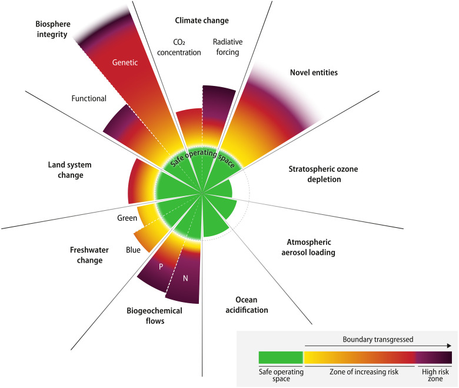

<!--
This is for including Chapter 1.  Notice that it's also good practice to name your chunk.  This will help you debug potential issues as you knit.  The chunk above is called intro and the one below is called chapter1.  Feel free to change the name of the Rmd file as you wish, but don't forget to change it here from chap1.Rmd.
-->

<!--
The {#rmd-basics} text after the chapter declaration will allow us to link throughout the document back to the beginning of Chapter 1.  These labels will automatically be generated (if not specified) by changing the spaces to hyphens and capital letters to lowercase.  Look for the reference to this label at the beginning of Chapter 2.
-->
# Introduction {#Intro}

## The Phosphorus problem
A great introduction explaining the global challenge and myriad of threats to our health and that of a sustainable way of living.
Introduce the Geological cylces of Life, from small to big, Carbon,Water, Nitrogen and of course phosphorus.

The evolution of humans on earth was followed by unprecedented changes in the Earths environment and disruption of the vital biogeochemical cycles underpinning the regenerative nature that characterized the climatologically stable Holocene epoch.  As a species that can recognize the importance of live and it's essential building blocks, we bear the responsibility of a fair and sustainable distribution of the earths resources. Unfortunately, externalizing impacts in favor of short-term profit has become [@richardson2023]

```{r boundries,echo=FALSE, fig.cap="P boundries", out.width="0.5\\linewidth", fig.align="center"}

```

## Phosphorus cycling in freshwater sediments
Talk about all the different forms P enters the sediment, and the early diagenesis.

The retention of P in sediments occurs through its binding to the solid phase via biological and chemical precipitation [@boers1998; @oconnell2020; @parsons2017]. Burial P pools accumulate in sediment following years of nutrient enrichment. The speciation of sediment P is highly dependent on lake conditions and undergoes significant changes during early diagenesis, where remobilisation of labile forms of P occurs, whereas only the stable forms of solid-bound P are buried long-term (Boers et al., 1998; Emerson, 1976). Initially, the sedimentation of P incorporated into organic matter (OM) by primary producers is an important influx of P to lake sediments, especially in eutrophic lakes. However, the long-term burial of OM-bound P is constrained by remineralisation processes in the sediment (Boers et al., 1998). Secondly, P can adsorb to iron (Fe) hydroxides (Gunnars et al., 2002) and bind to OM to form organic Fe-P complexes (Fe(III)-OM-P) (Schwertmann and Murad, 1988). The precipitation of these ferric iron-bound P forms (Fe(III)-P) can be a major internal sink of P in lakes with naturally high Fe content (Hupfer and Lewandowski, 2008; Reitzel et al., 2005) or those artificially treated with Fe (Kleeberg et al., 2012; Münch et al., 2024). Under the reducing conditions induced by organic matter decomposition in the sediment, Fe(III) is reduced to Fe(II), leading to the release of bound P and preventing the long-term burial of Fe(III)-bound P. However, P can be sequestered long-term in the form of the Fe(II) mineral vivianite (Fe(II)3(PO4)2·8H2O) (Rothe et al., 2016), which has been identified as a major form of burial P in eutrophic, high-Fe, and nonsulphidic freshwater systems (Dijkstra et al., 2018; Kubeneck et al., 2021; O’Connell et al., 2015; Rothe, 2016).

## Sulfur biogeochemistry

(Due to eutrophication, i.e. a primarily enhanced P supply, the P-binding capacity of a sediment will be exceeded leading to a higher P mobility and less or no vivianite formation. A higher productivity leads to a higher OM supply toward the sediment which has consequences for the formation of vivianite. First, there is a higher demand for oxidants leading to a deterioration of redox conditions and higher reduction rates of ferric Fe and SO24 (Holmer & Storkholm, 2001). Second, there is more S2– produced because OM is specifically enriched in S compared to Fe (Redfield ratio: C106N16P1S0.7Fe0.05, (Stumm & Morgan, 1981)). Sulphides are formed by both desulphuration and dissimilatory sulphate reduction leading to a higher degree of sediment sulphidization. 6

3.6 Conclusions The former can be quite significant in overall sedimentary hydrogen sulphide production, e.g. 5.1 - 53 % (Dunnette et al., 1985). Moreover, eutrophication is often accompanied by considerable inputs of SO24 leading to its higher availability and high rates of its consumption (Holmer & Storkholm, 2001; Zak et al., 2006). Third, the OM itself can react with Fe forming a metal organic complex (Lalonde et al., 2012). The higher the sedimentary S:Fe ratio, the less reactive Fe seems to be available reducing the potential of vivianite to form (Fig. 3.5) because more Fe is bound in sulphidic form. Thus, under eutrophic conditions there is a negative feedback evolving through the enhanced supply of OM lowering the sedimentary P retention capacity due to less vivianite. Aquatic systems naturally high in reactive Fe may compensate better for a eutrophication induced decrease in P retention than systems low in Fe. This implies, that an artificial supply of Fe to systems with a high level in OM, P and SO24 can be used as a successful measure of lake restoration leading to increased P retention through vivianite formation (Kleeberg et al., 2013; Rothe et al., 2014). To ensure a lasting effect on P burial, Fe has to be supplied in surplus compensating for the losses through FeSx formation (Kleeberg et al., 2013) and the reaction with OM (Lalonde et al., 2012). At which magnitude vivianite finally forms in different types of sediments depends on multiple factors and remains to be further investigated. The formation of the mineral is also controlled by the availability of OM rich in P, the concomittant liberation of Fe2+ and PO34 into the pore voids of the sediment, the activity of microorganisms and resorption of PO34 onto the surface of remaining iron(oxyhydr)oxides.) Rothe 2015


## Vivianite stability
Start at the beginning, vivianite characteristics.
Next, the formation requirments and kinetics [@paskin2024]
Then, the stability under oxygen conditions
And then the part about the sulfidation

\begin{equation}
  \mathrm{Fe_3(PO_{4})_2\bullet H_2O(s) + 2H^+} \rightleftharpoons \mathrm{3Fe^{2+} + 2HPO_4^{2-} + 8H_2O}
  (\#eq:vivianitedissolve)
\end{equation}

\begin{equation}
  \mathrm{Fe^{2+} + xHS^-} \rightleftharpoons \mathrm{FeS_x(s) + xH^+}
  (\#eq:sulfideform)
\end{equation}


## Research objectives and outline